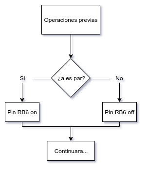
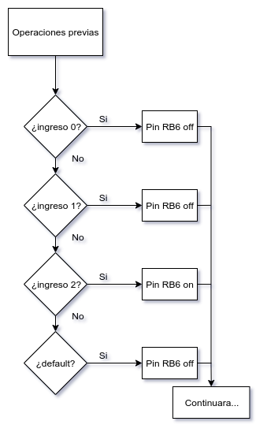
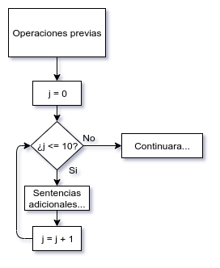
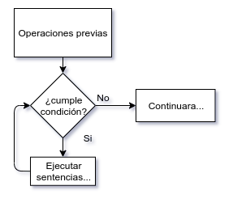
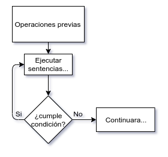

## Declaraciones de control
Son usadas para controlar el proceso de ejecución del programa.

### En CCS:
- If-Else
- While
- Do-While
- For
- Switch-Case
- Return
- Break, Continue y Goto

#### IF-ELSE
Permite tomar decisiones

### SWITCH
Es un caso particular de una decisión múltiple.

### FOR
Se usa para repetir sentencias.

### WHILE
Se usa para repetir sentencias.

### Do-While
Se usa para repetir sentencias.

### Return
Se emplea para devolver datos en las funciones

### Break
Permite salir de un bucle, se utiliza para el While, For, Do y Switch

### Continue
Finaliza la iteración en curso del bucle y provoca que se ejecute la siguiente iteración.

### Goto
Provoca un salto incondicional
